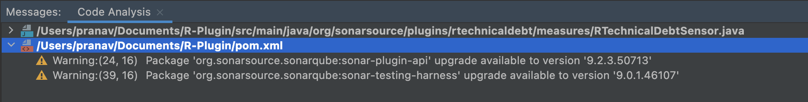

# R-Plugin

Built on the [SonarQube Plugin Example](https://github.com/SonarSource/sonar-custom-plugin-example)

Move plugin `.jar` file from `/target` to `sonarqube/extensions/plugins` and restart server.

SonarQube Version Error on plugin launch: Check that `pom.xml` has the correct `sonar.apiVersion`. Some IDE's will prompt you to update this, which might casuse issues.

